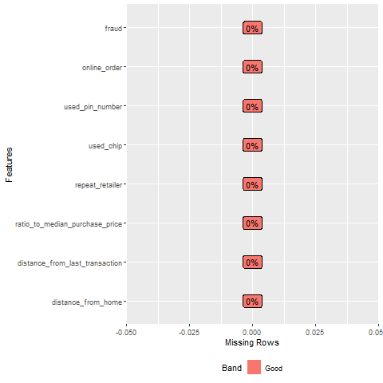
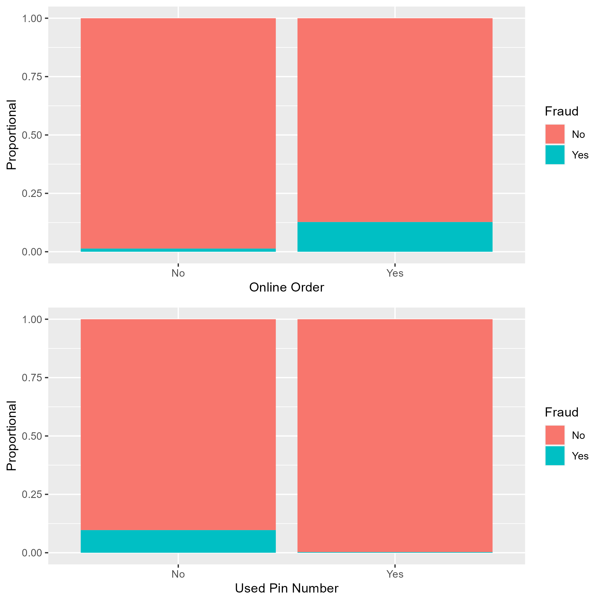
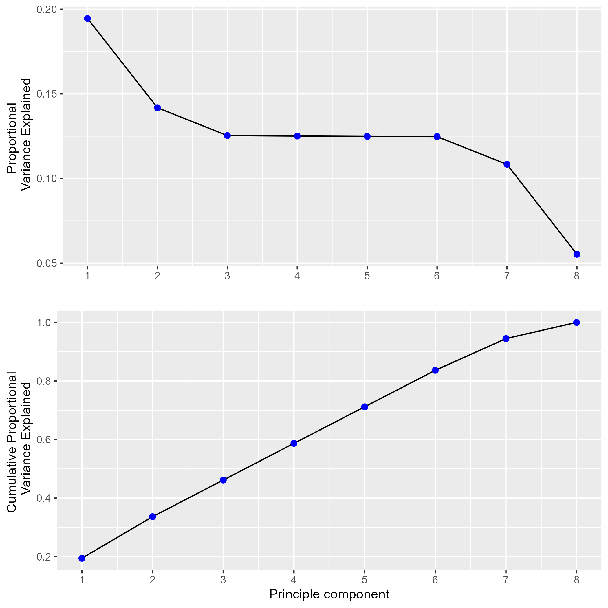
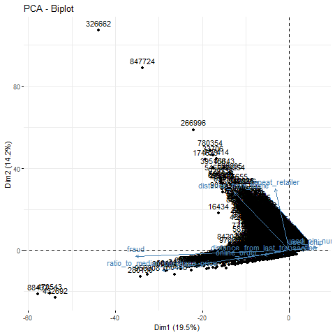
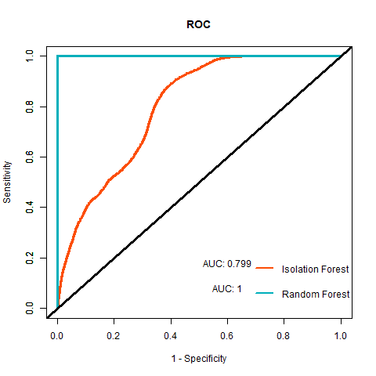
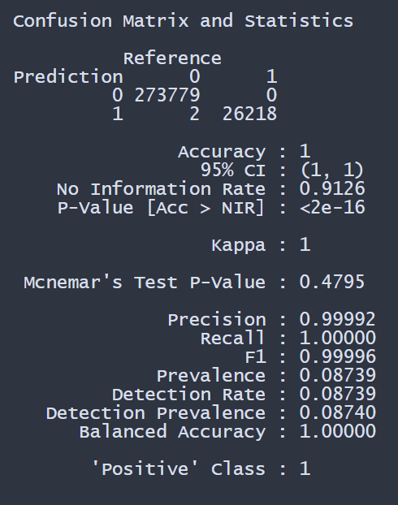
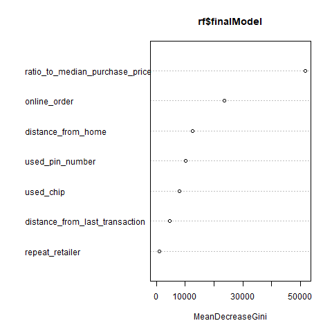
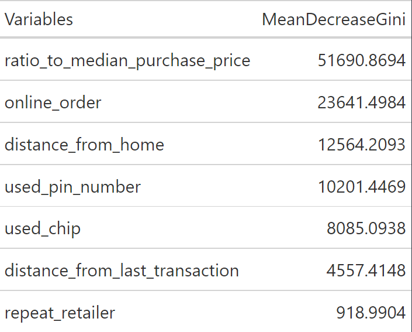

# Credit Card Fraud Anomaly Detection

In this project, we analysis credit card fraud data. The data can be found [here](https://www.kaggle.com/datasets/dhanushnarayananr/credit-card-fraud).

This data set contains  1,000,000 observations with 7 predictors and the response `fraud` which is defined as 1 for credit card fraud and 0 for no fraud in the credit card transaction. 

We compared two models, Random Forest and Isolation Forest. The Isolation Forest is used for anomaly detection, technique used to identity unusual patterns. In this case, to identify fraud credit card transactions. We treat Isolation Forest model has a supervised learning algorithm since the data set contains the true labels even though the model is an unsupervised learning algorithm. 

## Exploratory data analysis

The data set contains no NA values and the proportional of `fraud` is 0.087.  

The figure below show the proportion of `fraud` for online orders and whether  the pin number was used. The proportion of fraud is higher when  the transaction was online and no pin number was used. 

PCA was performed to explore the relationships between the variables in lower dimension space. The figure below gives the partial variance explained. The first 6 principal components explain about 84% of the entire data.

The biplot below shows the relationships between the variables. The first principal component has more weight `fraud`, `ratio_to_median_purchase_price`, `online_order`, `distance_from_last_transaction`, and `used_pin_number`. The second component has more weight on `distance_from_home` and `repeat_retailer`. From the plot, `ratio_to_median_purchase_price ` and `fraud` are correlated with each other.

Next we train the Isolated Forest and Random forest model on the training data. The ROC plot gives model performance in the testing data which consist of 300,000 observations. The Isolation Forest model has an AUC of 0.799. However, compared tp the no information rate is 0.9126 the Isolated Forest does not performed to good. The Random forest almost perfectly classify all observation with an AUC close to 1.  

The confusion matrix is for the Random Forest model. Out of the 300,000 observations the model only misclassified 2 observation. For those two cases the true values was not that the credit card transaction was not fraud and model predicted it was. 

With the Random forest model we can also determined the most important variables by the Gini index. A higher Gini index indicates the variable contributes to the model predicted performance. The plot below gives the order of importance by the Mean decrease in Gini index. Meaning how much the model performance would change is that variable was not in the model. Thus, the top most important variables are the  `ratio_to_mean_purchase_price`, `online_order` and `distance_from_home` in determining fraud in credit card transactions.

